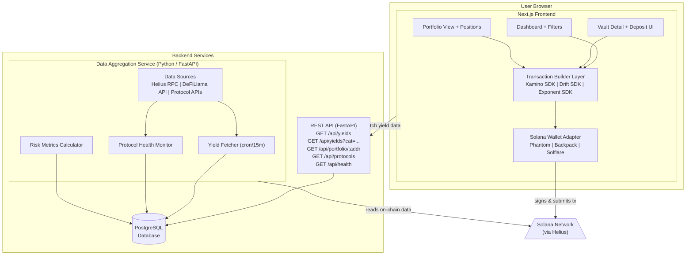
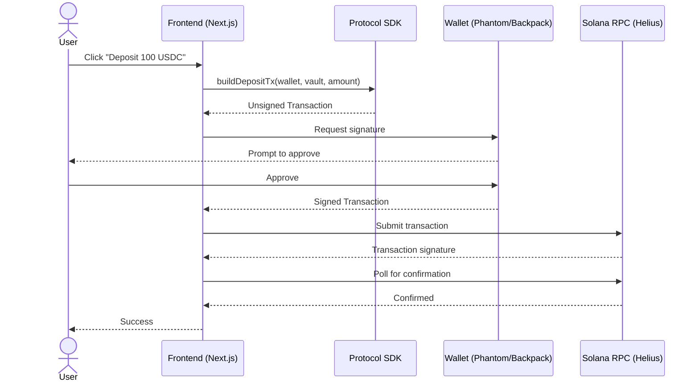
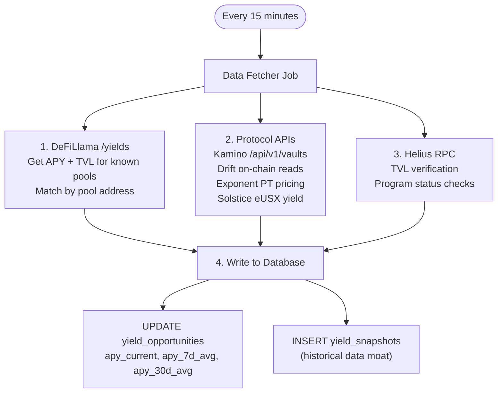

# Technical Architecture — Solana Yield Aggregator

> **Version:** 1.0
> **Last updated:** March 15, 2026

---

## 1. System Overview



---

## 2. Core Principle: Non-Custodial Transaction Flow

This is the most important architectural decision. The backend NEVER touches user funds. Here's how a deposit works:



**The backend is only used for:**
- Serving yield data (APY, TVL, protocol metadata)
- Reading wallet positions (public on-chain data)
- Storing historical yield snapshots

**The frontend handles:**
- All transaction construction (via protocol SDKs)
- Wallet interaction
- Transaction submission and confirmation

---

## 3. Tech Stack

### Frontend
| Component | Technology | Reason |
|---|---|---|
| Framework | **Next.js 14** (App Router) | Standard Solana dApp stack, SSR for landing page SEO |
| Language | **TypeScript** | Type safety for SDK interactions, you know it |
| Styling | **Tailwind CSS** | Fast to build, consistent look |
| Wallet | **@solana/wallet-adapter-react** | Standard, supports all major wallets |
| State | **React Query (TanStack Query)** | Caching yield data, polling, auto-refetch |
| Charts | **Recharts** or **Lightweight Charts** | Yield display, portfolio charts |

### Backend
| Component | Technology | Reason |
|---|---|---|
| Framework | **FastAPI** (Python) | Your strongest language, async, fast |
| Database | **PostgreSQL** | Relational, good for time-series yield data |
| ORM | **SQLAlchemy** + Alembic migrations | Industry standard for Python |
| Task scheduler | **APScheduler** or **Celery** (start with APScheduler) | Cron-like yield fetching every 15 min |
| Solana reads | **solana-py** + **Helius API** | On-chain reads for portfolio, protocol data |

### Infrastructure
| Component | Technology | Reason |
|---|---|---|
| Frontend hosting | **Vercel** | Free tier, instant deploys, Next.js native |
| Backend hosting | **Railway** or **Fly.io** | Easy Python deploys, managed Postgres addon |
| Database | **Railway Postgres** or **Supabase** | Free/cheap tier, managed |
| RPC | **Helius** (free tier: 100K credits/day) | Best Solana RPC with DAS API for token parsing |
| Monitoring | **Sentry** (free tier) | Error tracking |
| Domain | **Cloudflare** (DNS) | Free, fast |

### Protocol SDKs (Frontend — TypeScript)
| Protocol | Package | Docs |
|---|---|---|
| Kamino | `@kamino-finance/kliquidity-sdk` | https://github.com/Kamino-Finance/kliquidity-sdk |
| Drift | `@drift-labs/sdk` | https://github.com/drift-labs/protocol-v2/tree/master/sdk |
| Exponent | TBD — verify SDK availability | https://docs.exponent.finance |
| Solana core | `@solana/web3.js` | https://solana-labs.github.io/solana-web3.js/ |

---

## 4. Database Schema

```sql
-- Protocols we support
CREATE TABLE protocols (
    id              SERIAL PRIMARY KEY,
    slug            VARCHAR(50) UNIQUE NOT NULL,    -- 'kamino', 'drift', 'exponent'
    name            VARCHAR(100) NOT NULL,          -- 'Kamino Finance'
    description     TEXT,
    website_url     VARCHAR(255),
    logo_url        VARCHAR(255),
    audit_status    VARCHAR(50),                    -- 'audited', 'unaudited', 'in_progress'
    auditors        TEXT[],                         -- ['OtterSec', 'Halborn']
    launched_at     DATE,
    integration     VARCHAR(20) DEFAULT 'data_only', -- 'full', 'data_only', 'coming_soon'
    created_at      TIMESTAMP DEFAULT NOW(),
    updated_at      TIMESTAMP DEFAULT NOW()
);

-- Yield opportunities (vaults, pools, strategies)
CREATE TABLE yield_opportunities (
    id              SERIAL PRIMARY KEY,
    protocol_id     INTEGER REFERENCES protocols(id),
    external_id     VARCHAR(255),                   -- protocol's own vault/pool ID
    name            VARCHAR(200) NOT NULL,          -- 'USDC Lending Vault'
    category        VARCHAR(50) NOT NULL,           -- 'lending', 'delta_neutral', 'yield_tokenization', 'perps_earn', 'stable_amm'
    tokens          TEXT[] NOT NULL,                -- ['USDC'], ['USDC', 'USDT']
    apy_current     DECIMAL(10,4),                 -- 8.5000 = 8.5%
    apy_7d_avg      DECIMAL(10,4),
    apy_30d_avg     DECIMAL(10,4),
    tvl_usd         DECIMAL(20,2),
    min_deposit      DECIMAL(20,6),
    lock_period_days INTEGER DEFAULT 0,             -- 0 = no lock
    risk_tier       VARCHAR(20),                    -- 'low', 'medium', 'high' (manual curation)
    deposit_address VARCHAR(255),                   -- on-chain address for SDK
    is_active       BOOLEAN DEFAULT true,
    metadata        JSONB,                          -- flexible field for protocol-specific data
    created_at      TIMESTAMP DEFAULT NOW(),
    updated_at      TIMESTAMP DEFAULT NOW()
);

-- Historical yield snapshots (your proprietary data moat)
CREATE TABLE yield_snapshots (
    id              SERIAL PRIMARY KEY,
    opportunity_id  INTEGER REFERENCES yield_opportunities(id),
    apy             DECIMAL(10,4),
    tvl_usd         DECIMAL(20,2),
    snapshot_at     TIMESTAMP NOT NULL,
    source          VARCHAR(50)                     -- 'defillama', 'on_chain', 'protocol_api'
);

-- Index for fast time-range queries
CREATE INDEX idx_snapshots_opportunity_time
ON yield_snapshots (opportunity_id, snapshot_at DESC);

-- Index for category filtering
CREATE INDEX idx_opportunities_category
ON yield_opportunities (category, is_active);
```

**Note:** No user table. No user data stored. Portfolio is read live from the wallet's on-chain state.

---

## 5. API Endpoints

### `GET /api/yields`
Returns all active yield opportunities.

```json
// Query params: ?category=lending&sort=apy_desc&tokens=USDC
{
  "data": [
    {
      "id": 1,
      "protocol": {
        "slug": "kamino",
        "name": "Kamino Finance",
        "logo_url": "..."
      },
      "name": "USDC Lending Vault",
      "category": "lending",
      "tokens": ["USDC"],
      "apy_current": 8.52,
      "apy_7d_avg": 8.21,
      "tvl_usd": 45000000,
      "lock_period_days": 0,
      "risk_tier": "low",
      "integration": "full",       // "full" = can deposit, "data_only" = view only
      "deposit_address": "7K3UpbZViPnNXKqf..."
    }
  ],
  "meta": {
    "total": 24,
    "last_updated": "2026-03-15T14:30:00Z"
  }
}
```

### `GET /api/yields/{id}/history`
Returns historical APY snapshots for charts.

```json
// Query params: ?period=7d (7d, 30d, 90d)
{
  "data": [
    { "timestamp": "2026-03-15T14:00:00Z", "apy": 8.52, "tvl_usd": 45000000 },
    { "timestamp": "2026-03-15T13:00:00Z", "apy": 8.48, "tvl_usd": 44800000 }
  ]
}
```

### `GET /api/portfolio/{wallet_address}`
Reads on-chain positions for a given wallet. This endpoint calls Helius/on-chain to parse token accounts and match them against known protocol vaults.

```json
{
  "wallet": "7K3UpbZViPnN...",
  "positions": [
    {
      "protocol": "kamino",
      "vault_name": "USDC Lending Vault",
      "deposited_amount": 1000.00,
      "current_value_usd": 1042.50,
      "estimated_apy": 8.52,
      "tokens": ["USDC"]
    }
  ],
  "total_value_usd": 1042.50,
  "total_estimated_annual_yield_usd": 88.82
}
```

### `GET /api/protocols`
Returns all supported protocols with metadata.

---

## 6. Data Aggregation Pipeline



### Data Source Priority
1. **On-chain reads** (most accurate, but slowest)
2. **Protocol APIs** (fast, but may lag)
3. **DeFiLlama** (good coverage, ~5min delay typical)

For MVP: Start with DeFiLlama + protocol APIs. Add direct on-chain reads post-hackathon where accuracy matters.

---

## 7. Protocol Integration Architecture (Frontend)

Each protocol integration is a TypeScript module that implements a common interface:

```typescript
// src/lib/protocols/types.ts
interface ProtocolAdapter {
  // Build a deposit transaction
  buildDepositTx(params: {
    wallet: PublicKey;
    vaultAddress: string;
    amount: number;          // in token units (e.g. 100 USDC)
    tokenMint: PublicKey;
  }): Promise<Transaction>;

  // Build a withdraw transaction
  buildWithdrawTx(params: {
    wallet: PublicKey;
    vaultAddress: string;
    amount: number;          // amount to withdraw
    tokenMint: PublicKey;
  }): Promise<Transaction>;

  // Get user's position in a specific vault
  getPosition(params: {
    wallet: PublicKey;
    vaultAddress: string;
  }): Promise<Position | null>;
}

interface Position {
  depositedAmount: number;
  currentValueUsd: number;
  tokenSymbol: string;
  vault: string;
}
```

Each protocol gets its own adapter:

```
src/lib/protocols/
├── types.ts              # Common interface
├── kamino.ts             # KaminoAdapter implements ProtocolAdapter
├── drift.ts              # DriftAdapter implements ProtocolAdapter
├── exponent.ts           # ExponentAdapter implements ProtocolAdapter
└── index.ts              # Registry: protocol slug → adapter
```

The deposit flow in the UI:

```typescript
// Simplified deposit flow
async function handleDeposit(protocolSlug: string, vaultAddress: string, amount: number) {
  const adapter = getAdapter(protocolSlug);   // get the right SDK wrapper
  const tx = await adapter.buildDepositTx({
    wallet: walletPublicKey,
    vaultAddress,
    amount,
    tokenMint: USDC_MINT,
  });

  // Wallet adapter handles signing + submission
  const signature = await sendTransaction(tx, connection);

  // Poll for confirmation
  await connection.confirmTransaction(signature, 'confirmed');
}
```

---

## 8. Frontend Page Structure

```
app/
├── page.tsx                    # Landing page
├── app/
│   ├── layout.tsx              # App shell: sidebar, wallet button, navigation
│   ├── dashboard/
│   │   └── page.tsx            # Main yield dashboard with filters
│   ├── vault/[id]/
│   │   └── page.tsx            # Vault detail: APY chart, deposit/withdraw UI
│   ├── portfolio/
│   │   └── page.tsx            # User's positions across all protocols
│   └── category/[slug]/
│       └── page.tsx            # Category view (e.g. /category/lending)
├── components/
│   ├── YieldCard.tsx           # Single yield opportunity card
│   ├── YieldTable.tsx          # Table view of opportunities
│   ├── DepositModal.tsx        # Deposit flow modal
│   ├── WithdrawModal.tsx       # Withdraw flow modal
│   ├── PortfolioSummary.tsx    # Portfolio overview widget
│   ├── CategoryFilter.tsx      # Category tab bar
│   ├── RiskBadge.tsx           # Risk tier indicator
│   └── WalletButton.tsx        # Connect/disconnect wallet
└── lib/
    ├── protocols/              # Protocol adapters (see section 7)
    ├── api.ts                  # Backend API client
    └── constants.ts            # RPC endpoints, token mints, etc.
```

---

## 9. Portfolio Tracking Approach

Portfolio tracking works WITHOUT any user database. It reads public on-chain state.

**How it works:**
1. User connects wallet → frontend has their PublicKey
2. Frontend calls `GET /api/portfolio/{walletAddress}`
3. Backend reads token accounts for that wallet via Helius DAS API
4. Backend matches token holdings against known protocol receipt tokens:
   - Kamino: kToken (receipt for vault deposits)
   - Drift: Drift user account + vault depositor accounts
   - Exponent: PT tokens (Income Tokens) in wallet
5. Backend calculates current value based on latest on-chain prices
6. Returns structured position data

**Key token mappings (needs to be maintained):**
```python
PROTOCOL_TOKENS = {
    "kamino": {
        # kToken mints → vault mapping
        "KAMIxxxxx...": {"vault": "USDC Lending Vault", "underlying": "USDC"},
    },
    "drift": {
        # Drift uses user accounts, not receipt tokens
        # Need to parse DriftClient user account
    },
    "exponent": {
        # PT token mints → market mapping
        "EXPTxxxxx...": {"market": "Kamino USDC PT", "underlying": "USDC", "maturity": "2026-06-15"},
    }
}
```

---

## 10. Security Considerations

| Concern | Mitigation |
|---|---|
| Backend never touches private keys | Transactions built in browser, signed by user's wallet |
| No user data stored | Only market data in DB; positions read from chain |
| RPC manipulation | Use trusted RPC (Helius) + verify critical data on-chain |
| SDK supply chain | Pin exact SDK versions, audit package.json regularly |
| Displayed APY accuracy | Show data source + timestamp, avoid words like "guaranteed" |
| Protocol exploits | Clear disclaimers, transparent risk methodology, no "safe" labels |

---

## 11. Local Development Setup

```bash
# Prerequisites
# Node.js >= 18, Python >= 3.11, PostgreSQL 15+

# Frontend
cd frontend
npm install
cp .env.example .env.local    # Add Helius RPC URL
npm run dev                    # http://localhost:3000

# Backend
cd backend
python -m venv venv
source venv/bin/activate
pip install -r requirements.txt
cp .env.example .env           # Add DB URL, Helius API key
alembic upgrade head           # Run migrations
uvicorn app.main:app --reload  # http://localhost:8000

# Database
createdb yield_aggregator
```

---

## 12. Repository Structure

```
yield-aggregator/
├── docs/
│   ├── 01-MVP-SCOPE.md
│   ├── 02-ARCHITECTURE.md
│   └── 03-ROADMAP.md
├── frontend/
│   ├── src/
│   │   ├── app/              # Next.js app router pages
│   │   ├── components/       # React components
│   │   └── lib/              # Protocol adapters, API client, utils
│   ├── package.json
│   └── next.config.js
├── backend/
│   ├── app/
│   │   ├── main.py           # FastAPI app
│   │   ├── routers/          # API route handlers
│   │   ├── services/         # Business logic (yield fetcher, portfolio reader)
│   │   ├── models/           # SQLAlchemy models
│   │   └── schemas/          # Pydantic schemas
│   ├── alembic/              # DB migrations
│   ├── requirements.txt
│   └── .env.example
├── scripts/
│   └── seed_protocols.py     # Seed DB with initial protocol data
└── README.md
```
